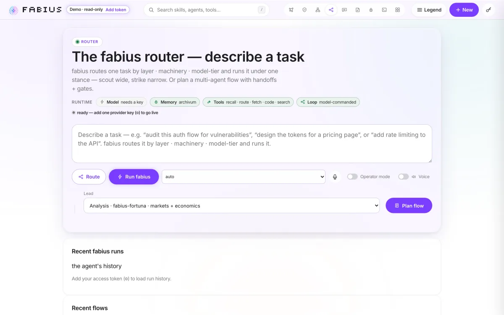
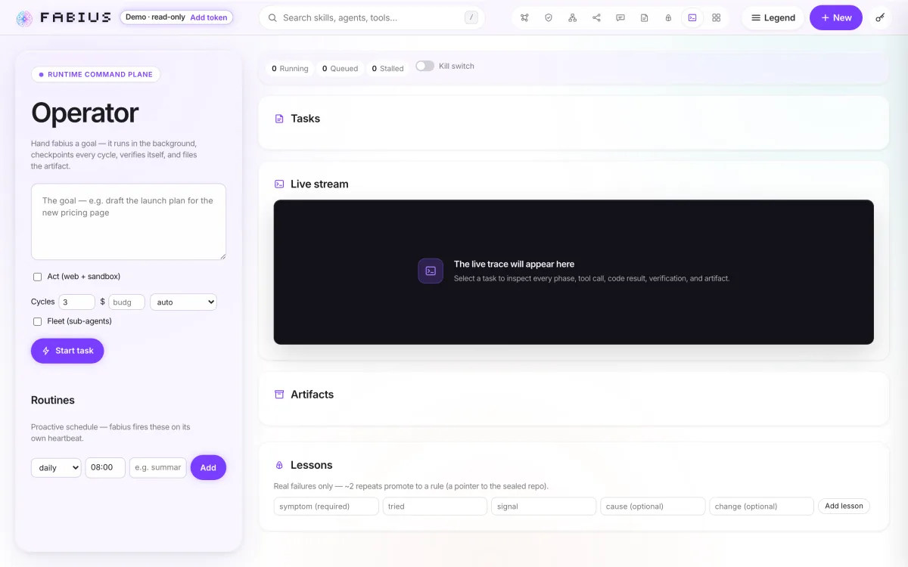
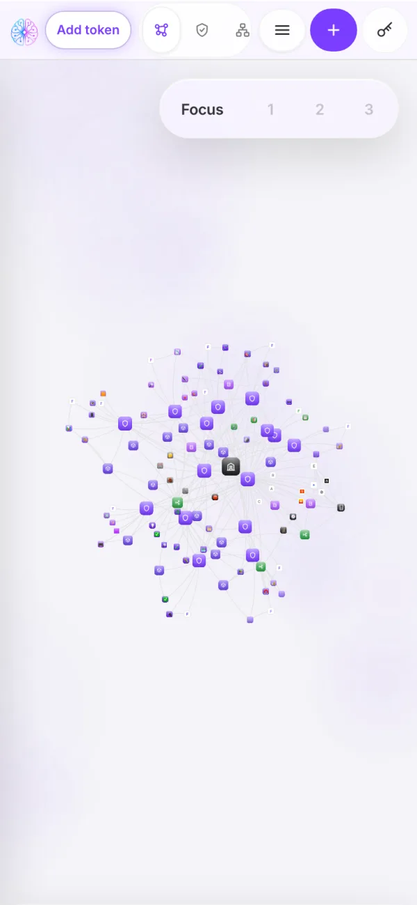

# SYNAPSE

> **The operating console for fabius, one AI agent wired to six model providers, for the person who must watch it spend money and be able to stop it.**

**Live:** [synapse-vert-one.vercel.app](https://synapse-vert-one.vercel.app)

  

On site it is fabius; the served `<title>` reads *"fabius — scout wide · strike narrow · one agent, every model, one stance."* Nine tabs (Graph, Skills, System, Router, Chat, Missions, Memory, Operator, Dashboard) sit over a force-directed canvas of the agent's own architecture. No build step: `index.html` loads 21 global-IIFE scripts plus pinned `force-graph@1.43.5` and `gsap@3.12.5`. No module imports another: `js/store.js` is the sole API client and sole writer of `window.ORG`, and the rest talk over a `CustomEvent` bus. The backend is one Cloudflare Worker, `worker/src/index.js`, 4,882 lines in one file, over D1, Vectorize and Workers AI.

## Routing each task to the cheapest tier that still holds

`route(task)` is pure and returns its rationale: R1 classifies the task on three axes, R2 walks a capability ladder, R11 takes the cheapest tier that holds. Six providers (Anthropic, OpenAI, Google Gemini, Mistral, Groq, and a HuggingFace router reaching hundreds of open repos on one Hugging Face token) carry `frontier`/`mid`/`fast` defaults. A **Route** button shows rung, tier and model before a token is spent.

## Checkpointing background runs so an evicted isolate cannot lose them

Operator tasks run under `ctx.waitUntil`, where the isolate can vanish mid-run, so each cycle checkpoints into `task_events`. Exit needs both a reviewer pass at score 70 or better **and** a deliverable that is not a stub. No progress plus the same top issue sets `stalled` and parks an approvals row rather than spinning. Cron `*/10 * * * *` fires due routines, capped at 2 per tick against denial-of-wallet, and resumes tasks whose heartbeat went stale.

## Gating spend behind a kill switch, a wall and an inbox

`fetch()` orders its gates deliberately: token check, then rate limit and daily cap (429 *before* any provider call), then the kill switch (409 on every spending endpoint, while reads and cancels stay up). Budgets are checked before spend and held in integer micro-USD, so cost does not drift as cycle rows accumulate. A `gate:true` task parks in an inbox whose decide endpoint is atomic: a double decision gets 409. The fetch tool re-validates **every** redirect hop against the SSRF allowlist and blocks at hop 3; validating the front door alone leaves the metadata service one 302 away.

## Staying honest when no model actually ran

Without a provider key the Worker simulates the loop and says so: verdicts are tri-state (confirmed, plausible, simulated), a simulated run is flagged `PASS (simulated)` beside "no real gate ran — add a provider key", and the rule-firing counter counts only real runs. Memory is verify-gated: only reviewed output compounds into recall. A token-less visitor gets the bundled seed marked "Demo · read-only"; every write stays 401.

Two gotchas are worth carrying forward. First, workerd type-checks every named export as a handler-map entry, so a bare exported number or string crashes the isolate on boot; `wrangler dev` caught it locally before it ever shipped — `node --test` cannot — and primitives now ride inside `OP_TUNING`. Second, a `401` on `/api/*` never proves a route exists: the auth gate returns before the router.

## Verifying against the live URL, not just the laptop

- **195/195 Worker unit tests** across 11 test files (`node --test worker/test/*.test.js`), re-run 2026-08-31.
- Release sweep, 2026-07-30: Chromium over all nine views at desktop and mobile, a 320px to 1920px width sweep including the 1660/1661px navigation breakpoint, WebKit on four of them.
- Re-run against the deployed alias: the served HTML and the changed CSS/JavaScript byte-identical to the local commit.

## Screenshots

  

  

  

## Stack

`Vanilla JS (no bundler)` · `force-graph 1.43.5 + GSAP 3.12.5` · `Cloudflare Worker` · `D1` · `Vectorize (768-dim cosine)` · `Workers AI` · `Vercel`

Source is private. Built by [@shear559](https://github.com/shear559).
